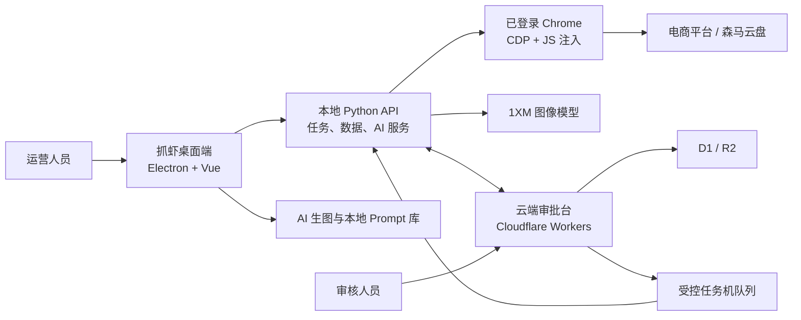

# 🦐 抓虾 · Crawshrimp

**面向电商运营的本地自动化、AI 素材生产与云端审批协作平台。**

[](https://github.com/howtimeschange/crawshrimp/releases)
[](https://github.com/howtimeschange/crawshrimp/actions/workflows/build-desktop.yml)
[](LICENSE)

抓虾把三类工作放进同一套产品里：在已登录的 Chrome 中执行电商平台自动化，在桌面端完成 AI 生图与提示词管理，并通过可选的云端审批台让审核人员和任务机协同完成测图、重生图、上传与数据回收。

## v2.2.0 AI 视频工作台与电商运营工作流（2026-07-17）

`v2.2.0` 新增面向日常素材生产的 AI 视频工作台，并把巴拉图片审核、视频生成及天猫竞品监控等运营流程纳入可追踪的本地任务链路。

- AI 视频工作台支持 Seedance 与百炼视频任务、持久化草稿/运行记录、结果自动刷新、缩略图恢复、历史清理与安全的本地媒体访问。
- 巴拉流程新增素材选择、AI 生图批次审核、审核结果导出和「审核通过后再生成视频」的明确边界；同时补充模型图库与 HappyHorse / 百炼执行能力。
- 天猫运营助手新增会员中心截图监控、竞品付费监控与导出，并加强长任务、截图和页面结构变化下的稳定性。
- 脚本列表支持本地持久化收藏；仓库内置网页自动化 skill，便于复用已验证的浏览器执行与取证能力。

完整变更见 [v2.2.0 Release Notes](release-notes/v2.2.0.md)。

## v2.1.4 电商适配与 Windows 运行时回退（2026-07-13）

`v2.1.4` 修复了 Temu 评价分页、天猫 AI 测图素材匹配和 Windows 旧数据目录访问三类边界问题。

- Temu 将请求的 20 条评价静默限制为 10 条且未返回分页信息时，抓取会基于已观察到的实际页大小继续翻页，不会在第一页提前结束。
- 天猫 AI 测图默认从巴拉产品上新根目录检索各季素材；主图匹配优先选择 `yz(1)` / `yz1` 原图，避免被橱窗海报抢占。
- Windows 无法读取旧 `.crawshrimp` 数据目录时，会记录原因并安全回退到平台默认目录，不再阻断应用启动。

完整变更见 [v2.1.4 Release Notes](release-notes/v2.1.4.md)。

## 产品架构



默认链路是本地优先：登录态、云盘找图、平台上传和本地文件处理留在任务机器；云端负责共享审批、Prompt 协作、任务调度和数据看板。云端审批是可选模块，不影响普通 Adapter 在单机运行。

## 核心能力

### AI 生图工作台

- GPT Image 与 Gemini 图像模型统一参数面板，比例、尺寸、质量和模型能力联动。
- 单条 Prompt、批量 Prompt、每条 Prompt 独立出图数量与异步队列状态。
- 1XM `task_id` / `poll_url` 持久化，应用重启后可继续刷新未完成任务。
- 生成结果优先落到本地缓存；远端预览异常时可恢复缓存，不只依赖临时 URL。
- 保留来源图、编辑分支和当前图片的完整谱系，支持 Tldraw 标注与二次编辑。
- 任务历史支持置顶、删除、共享缓存保护和稳定的结果卡片布局。

### 本地与云端 Prompt 库

- 本地 Prompt 库开箱即用，按分组和字段维护，可直接被单次生图、批量生图和天猫测图任务复用。
- 云端 Prompt 库支持 Excel 导入/导出、草稿与发布版本、品类/性别优先级解析。
- 请求防串线和 stale-response guard 避免切换库或网络延迟时展示旧数据。
- 云端不可用时仍可使用本地库，保持核心生图链路可运行。

### 云端审批与任务机

- 独立网页与抓虾内嵌页共用同一套登录、RBAC 和审计记录；不开放公众注册。
- 批次列表、单款审图、批量通过/舍弃、资源去重、在线重生图和提交计划。
- 任务机使用一次性注册 token 换取长期 machine token，按 capability 领取任务。
- 调度任务带租约、心跳、取消、幂等和失败状态，避免重复上传或离线任务机抢占。
- 测图数据看板支持原始 Excel 导入、定时抓取、同日去重、跨日期累计快照和素材明细钻取。

### 网页自动化底座

- Adapter 插件化：每个平台独立 `manifest.yaml + JavaScript`，可本地目录、链接模式或 ZIP 安装。
- CDP 直连已登录 Chrome，底座统一负责注入、分页、超时、重试、页面恢复和文件下载。
- Excel / JSON / SQLite 落盘，支持多 Sheet、模板下载、预检后执行、定时任务与钉钉/飞书/Webhook 通知。
- 本地 API 默认需要 `X-Crawshrimp-Token`，运行数据目录和桌面进程使用同一套解析规则。

## 快速开始

### 下载桌面版

前往 GitHub Releases：

- [正式版本列表](https://github.com/howtimeschange/crawshrimp/releases)
- [滚动桌面构建 desktop-latest](https://github.com/howtimeschange/crawshrimp/releases/tag/desktop-latest)

正式版提供以下手动安装包：

- `crawshrimp-v版本号-mac-arm64.dmg`
- `crawshrimp-v版本号-mac-x64.dmg`
- `crawshrimp-v版本号-win-x64.exe`

正式 `vX.Y.Z` Release 与 `desktop-latest` 都包含应用内更新 bridge 资产：macOS arm64/x64 ZIP 与 blockmap、`latest-mac.yml`，以及 Windows EXE blockmap 与 `latest.yml`。

应用内稳定更新优先从 [Cloudflare R2 下载源](https://updates.crawshrimp.com/) 读取这些已校验资产；检查失败时会自动回退 GitHub。每次正式 tag 会先将资产同步到 R2，确认可读后才发布 GitHub Release；安装包仍保留原有 macOS 签名/公证和 `latest*.yml` 的 SHA512 校验。

安装包内置 Python 运行时，普通用户不需要单独安装 Python 或 Node.js。

从带桌面自动更新的 bridge 版本开始，已安装用户不需要卸载旧版：下载正式 Release 安装包覆盖安装一次即可接入后续应用内更新。Windows 使用 NSIS 在原安装路径就地更新；macOS 的应用内更新使用 ZIP/ShipIt，DMG 只用于首次安装、bridge 覆盖或应用内更新失败后的手动 fallback。

Windows 从旧版手动覆盖安装前，先结束正在运行的任务，再从抓虾窗口正常退出应用。若 NSIS 显示“抓虾无法关闭”，说明旧版 `抓虾.exe` 或它的嵌入式 Python 仍占用安装目录；不要在任务运行时强制结束进程。确认抓虾窗口已经退出后，可在任务管理器中仅结束安装目录下残留的抓虾/Python 进程，再点击安装器的“重试”。干净电脑首次安装不应出现该提示。

运行数据、Chrome profile、任务缓存和配置保存在系统用户数据目录，不写入程序安装目录；覆盖安装和应用内更新不应删除这些数据。更新下载完成后，如果抓虾还有任务运行，安装会等待任务结束；普通退出不会偷偷安装，必须由用户点击 `重启安装` 才会替换版本。Windows 在正式代码签名前可能出现 Unknown Publisher 提示。

侧边栏底部默认只显示当前版本；只有检测到可用更新时才显示 `更新` 操作。进入具体脚本视图后，侧边栏保持展开，避免任务表单和脚本上下文被折叠打断。

`desktop-latest` 用于手动 QA/bridge 安装包，并保留 GitHub 更新 bridge 资产：旧客户端可先通过它升级；v2.1.2 及之后优先读取 `https://updates.crawshrimp.com/` 的 Cloudflare R2 元数据，失败时自动回退 GitHub。

#### macOS

从 `v1.4.36` 起，正式 tag 构建会在密钥配置完整时执行 Developer ID 签名与 Apple 公证。下载 DMG 后将抓虾拖入 Applications；若旧包或下载隔离仍提示无法验证，可执行：

```bash
xattr -cr "/Applications/抓虾.app"
```

### 第一次运行

1. 打开抓虾，在「设置」中配置需要使用的 1XM 模型密钥与通知渠道。
2. 让抓虾启动受管 Chrome，或手动用 `--remote-debugging-port=9222` 启动 Chrome。
3. 在该 Chrome 中登录目标电商平台或云盘。
4. 从「我的脚本」运行 Adapter，或从「AI 生图」直接创建素材任务。
5. 如需多人审批，在「设置 → 云端审批」配置服务地址、注册任务机，并在侧边栏打开「云端审批」。

## 典型 AI 测图链路

```text
测图工作流 Excel
  → 按款号从森马云盘选择参考图
  → 本地/云端 Prompt 库按品类和性别匹配
  → 1XM 异步生图并缓存到本地
  → 本地确认或同步云端审批
  → 审核通过 / 舍弃 / 重生图
  → 受控任务机上传天猫素材并创建测图任务
  → 定时抓取测图数据并同步云端看板
```

「巴拉-AI测图全链路」支持两种执行模式：

- **审批后创建**：生成审批批次，人工确认后只上传通过的图片。
- **直接创建**：生图完成后直接进入天猫素材上传与测图任务创建。

任务可选择本地 Excel 或线上 Prompt 库、参考图范围、Prompt 条数、每 Prompt 出图数、模型、比例、尺寸、质量、通知渠道和导出目录。生成证据工作簿会记录 Prompt、模型任务 ID、轮询地址、本地文件、审批状态、测图任务和页面读回结果。

## 云端审批台（可选）

云端代码位于 [`cloud/approval-workbench`](cloud/approval-workbench/)，技术栈为 Vue 3 + Cloudflare Workers + D1 + R2。

本地启动：

```bash
cd cloud/approval-workbench
npm ci
npm run check
npm run dev
```

部署前需要创建/绑定 D1 与 R2、执行 migrations、通过 Wrangler Secret 配置 1XM 密钥，并用管理员种子工具创建首个账号。不要把 Cloudflare token、管理员密码、会话 cookie、1XM key 或 machine token 写入仓库。

完整的部署、首个管理员、Prompt 导入、任务机注册、批次同步、测图提交、数据抓取和 dry-run 步骤见 [Cloud Approval Workbench Runbook](docs/cloud-approval-workbench-runbook.md)。

## 从源码启动

### 环境要求

- macOS 或 Windows
- Chrome
- Python 3.10+（CI 使用 3.11）
- Node.js 22.12.0+（推荐与 CI 一致）

### 安装依赖

```bash
git clone https://github.com/howtimeschange/crawshrimp.git
cd crawshrimp

python3 -m venv venv
venv/bin/pip install -r core/requirements.txt

npm --prefix app ci
npm --prefix cloud/approval-workbench ci
```

### 启动桌面开发环境

终端一：

```bash
bash dev.sh
```

终端二：

```bash
cd app
npm run dev
```

默认地址：

- 本地 API：`http://127.0.0.1:18765`
- API 文档：`http://127.0.0.1:18765/docs`
- Vite：`http://127.0.0.1:5173`
- 云端审批本地 Worker：`http://127.0.0.1:8787`

除 `/health` 和 API 文档外，本地 API 默认要求 `X-Crawshrimp-Token`。`dev.sh` 会从运行目录读取或生成 token 并打印使用方法。

### 手动启动 CDP Chrome

抓虾桌面端通常会管理独立 Chrome 配置。如需手动启动：

```bash
# macOS
/Applications/Google\ Chrome.app/Contents/MacOS/Google\ Chrome \
  --remote-debugging-port=9222 \
  --user-data-dir=/tmp/chrome-crawshrimp

# Windows
chrome.exe --remote-debugging-port=9222 --user-data-dir=%TEMP%\chrome-crawshrimp
```

### 验证

```bash
# Electron / renderer 单元测试
npm --prefix app test

# Adapter 与桌面契约测试
node --test tests/*.test.js

# Python 后端测试
PYTHONPATH=. venv/bin/python -m unittest discover -s tests -p 'test_*.py' -v

# Cloudflare 审批台：typecheck + test + build
npm --prefix cloud/approval-workbench run check
```

## 内置适配包

| Adapter | 平台 | 主要能力 |
|---|---|---|
| `aliexpress-ops-assistant` | 速卖通 | 成交分析、商品排行、商品主图抠图下载 |
| `amazon-ops-assistant` | Amazon | Reviews 全量抓取、商品标签 PDF 批量拆分 |
| `cross-border-research` | Renner / Zara / Macy's | 儿童鞋服品类、价格带、上新与促销调研 |
| `dasen-ops-assistant` | 森马 AI 工作台 | 案例批量创建、编辑模板导出、已发布案例批量编辑 |
| `doudian-ops-assistant` | 抖店 | 商城混资报名监控、订单复盘与平台优惠归因 |
| `jd` | 京东 | 全店价格导出、破价巡检与通知 |
| `lazada-plus-v1` | Lazada | 生意参谋官方报表、优惠券与 Flexi Combo 批量创建 |
| `mop-ops-assistant` | 千牛素材中心 / MOP | 云盘下载、搜推图文发布、KOL 素材转短视频 |
| `plm-ops-assistant` | Centric PLM | 尺寸表单定位、尺码表下载、宽表/长表导出 |
| `semir-cloud-drive` | 森马云盘 / AI 平台 | 图包下载、搭配购匹配、AI 参考素材准备、自动生图 |
| `shein-helper` | SHEIN | 商品评价、商品明细、质量数据、公网商品导出 |
| `shenhui-new-arrival` | 森马云盘 / 深绘 | 上新图包整理、PDF 截图、深绘图片包上传 |
| `shopee-plus-v2` | Shopee | 商业分析、商店/买家/关注礼优惠券、直播优惠券 |
| `shopee-webchat-bulk-reply` | Shopee 聊聊 | 按 Excel 搜索会话并预演或批量发信 |
| `shopify-ops-assistant` | Shopify | Admin 客流数据抓取与数仓同步 |
| `temu` | Temu | 商品、流量、评价、售后、财务、活动、合规等运营数据与操作 |
| `tiktok-ops-assistant` | TikTok Shop | 商品数据、商品管理、评分、达人视频采集下载 |
| `tmall-ops-assistant` | 天猫 | 买家评价、包装图上传、AI 测图全链路、测图数据导出 |
| `vipshop-ops-assistant` | 唯品会 | 轻供款商品报表与字段归一化 |
| `weimob-ops-assistant` | 微盟 / 森马 MDM | 商品上新、EAN/SKU 映射预演与保存 |

当前仓库只保留 `shopee-plus-v2` 这一条 Shopee 运营 Adapter；旧 `shopee` / `shopee-plus` 已移除。

## 运行数据与安全

运行目录解析顺序：

- Windows：优先 `%LOCALAPPDATA%\crawshrimp`
- macOS：优先 `~/Library/Application Support/crawshrimp`
- 其他环境：优先 `~/.crawshrimp`
- 可通过 `CRAWSHRIMP_DATA=/absolute/path` 显式指定

默认目录不可写时会选择下一候选目录。命令行或独立服务显式指定 `CRAWSHRIMP_DATA` 且未开启回退时会直接报错；桌面客户端会把环境变量、已保存配置或旧版目录作为首选路径，首选不可写时自动切换到可写的系统用户数据目录，并在设置页展示和持久化恢复结果。运行数据不会提交到 Git。

桌面端设置页提供“修复核心服务”“修复 Chrome 连接”和“打开诊断日志”。核心服务修复会重新检查数据目录、端口和 Python 健康状态；Chrome 修复只会结束身份确认属于抓虾的专用实例，9222 被未知服务占用时不会自动杀进程。

安全边界：

- 本地 API token、平台登录 cookie、云端 session、1XM key、Cloudflare token 和 machine token 都不应提交到仓库。
- 云端审批不开放注册；管理员创建用户并分配角色。
- 浏览器登录态操作与本地文件访问留在任务机；云端只下发已授权 capability 范围内的任务。
- 云端资源上传使用批次/机器作用域，文件名与元数据会清理本地路径和敏感字段。

## Adapter 开发

最小 Adapter：

```text
my-adapter/
  manifest.yaml
  my-task.js
```

`manifest.yaml` 定义平台入口、参数、触发方式与输出；任务脚本返回 `{ success, data, meta }`。详细规范见 [Adapter 开发文档](sdk/ADAPTER_GUIDE.md) 与 [Manifest Schema](sdk/manifest.schema.json)。

### 安装本地 Adapter

```bash
TOKEN_FILE="$(PYTHONPATH=. venv/bin/python - <<'PY'
from core import runtime_paths
print(runtime_paths.data_root() / 'api-token')
PY
)"

curl -X POST http://127.0.0.1:18765/adapters/install \
  -H 'Content-Type: application/json' \
  -H "X-Crawshrimp-Token: $(cat "$TOKEN_FILE")" \
  -d '{"path":"/absolute/path/to/my-adapter","install_mode":"link"}'
```

`link` 适合开发时即时生效；交付时使用默认 `copy` 或 ZIP。GUI「我的脚本」也支持选择目录或 ZIP 安装。

### 开发态 Harness

`scripts/crawshrimp_dev_harness.py` 统一提供页面快照、知识检索、网络捕获、临时 JS 执行和结构化 probe：

```bash
venv/bin/python scripts/crawshrimp_dev_harness.py snapshot --adapter temu --task goods_traffic_detail
venv/bin/python scripts/crawshrimp_dev_harness.py knowledge --adapter temu --task goods_traffic_detail --query drawer
venv/bin/python scripts/crawshrimp_dev_harness.py capture --adapter temu --task goods_traffic_detail --capture-mode passive
venv/bin/python scripts/crawshrimp_dev_harness.py eval --adapter temu --task goods_traffic_detail --file /absolute/path/to/check.js
```

`capture` 和 `probe` 默认不保存响应 body；显式使用 `--response-body` 时会先脱敏 token、cookie 与密码字段。

## 目录结构

```text
crawshrimp/
├── app/                         # Electron + Vue 3 桌面端
├── core/                        # Python API、AI、任务、数据与云端客户端
├── adapters/                    # 内置业务 Adapter
├── cloud/approval-workbench/    # Cloudflare 审批台（Worker + Vue + D1 + R2）
├── scripts/                     # 开发 Harness、dry-run 与运维脚本
├── tests/                       # Node / Python 集成与契约测试
├── docs/                        # Runbook、设计与验证记录
├── release-notes/               # 版本发布说明
└── sdk/                         # Adapter 开发规范与 Schema
```

## 构建与发布

GitHub Actions 工作流为 [Build Desktop App](.github/workflows/build-desktop.yml)：

- 推送 `main`：运行完整测试并构建 macOS / Windows 桌面产物，用于验证主分支。
- 推送 `v*` tag：再次测试与构建，执行 macOS 签名/公证（密钥齐全时），发布正式版本并刷新 `desktop-latest`。
- 正式 Release 包含 macOS arm64、macOS x64、Windows x64 和 Windows blockmap。
- 正式 tag 会将全部 updater 资产先同步到 Cloudflare R2：版本化安装包与 blockmap 使用长期 immutable 缓存，`latest.yml`/`latest-mac.yml` 使用每次重新校验的缓存策略；R2 同步失败会阻止 GitHub Release 发布。
- `desktop-latest` 保持 `latest=false`，并上传手动安装包及完整 ZIP/YAML/blockmap bridge 资产；正式 `vX.Y.Z` Release 仍是 GitHub 的正式版本记录。

应用版本以 `app/package.json` 和 `app/package-lock.json` 为准；tag 必须与版本号一致。每次发布先按[发布版本号规则](docs/release-versioning.md)确定 PATCH、MINOR 或 MAJOR 等级。详细版本说明存放在 `release-notes/vX.Y.Z.md`。

## 相关文档

- [云端审批台 Runbook](docs/cloud-approval-workbench-runbook.md)
- [云端审批 MVP 测试记录](docs/cloud-approval-workbench-mvp-test-log.md)
- [桌面更新发布验收清单](docs/desktop-update-release-checklist.md)
- [Adapter 开发指南](sdk/ADAPTER_GUIDE.md)
- [历史 Release Notes](release-notes/)

## License

[MIT](LICENSE)
