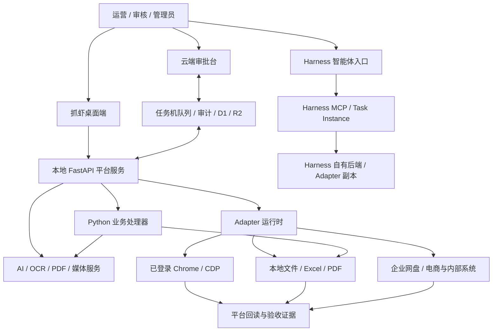

# 抓虾当前产品架构说明

> 状态：Current ｜ 基线：抓虾源码 v2.5.3 / Electron 43.1.0 ｜ 复核：2026-09-08
>
> 本文以当前本地源码为依据；版本号不代表远端部署核验。系统分层描述已实现能力，开放策略、安全要求和验收定义描述开发与交付要求，不表示所有任务已统一强制执行。具体使用方法见 `README.md`，Adapter 开发协议见 `sdk/ADAPTER_GUIDE.md`，云端部署见 `docs/cloud-approval-workbench-runbook.md`。

## 1. 一句话定义

抓虾是面向电商运营的本地优先执行与 AI 内容生产平台：它把已登录浏览器、本地文件、企业网盘、AI/OCR、可复用业务 Adapter、人工审批和受控任务机连接成可执行、可恢复、可核验的工作流。

抓虾不再只是“给网页注入 JavaScript 并导出 Excel”的通用自动化工具。网页自动化仍是底座，但产品核心已经变成：

```text
接收业务目标
  → 获取网页、表格、图片、PDF 或网盘素材
  → 由 Adapter、Python 处理器和 AI/OCR 协同执行
  → 按具体工作流提供审批、留痕和恢复
  → 交付文件、平台操作结果或云端批次
  → 读回结果并按业务规则验收
```

## 2. 产品家族与仓库关系

### 2.1 Crawshrimp 主项目

当前仓库 `crawshrimp` 是平台能力和业务能力的主发布线，提供：

- Electron + Vue 桌面工作台；
- FastAPI 本地服务、SQLite 与本地运行数据；
- 已登录 Chrome 的 CDP 执行、文件处理和任务调度；
- Adapter 安装、运行、恢复、导出与通知；
- AI 生图、AI 生视频、Prompt、OCR 和多模型路由；
- 可选的 Cloudflare 云端审批台与任务机执行链路；
- 森马等企业场景的 Adapter 和固定工作流。

主项目既能独立运行普通 Adapter，也能作为云端审批系统的任务机。

### 2.2 Crawshrimp Harness

`crawshrimp-harness` 是独立发布的智能体交互线，不是主项目的替代品，也不是主仓库的文档镜像。它复用抓虾的任务、Adapter、文件、浏览器、媒体、审批和审计能力，把 DeepSeek Harness（DSH）会话作为主要交互界面，并通过 MCP 把自然语言意图连接到 Task Instance 和 Adapter。

Harness 仓库包含自己的后端与 Adapter 副本，MCP 通常连接 Harness 自己的本地服务，并不要求另行启动主项目。二者复用能力与代码，但不是共享同一个运行进程或自动同步数据：

| 维度 | Crawshrimp 主项目 | Crawshrimp Harness |
| --- | --- | --- |
| 主入口 | 脚本列表、任务表单、AI 工作台、云端审批页 | DSH 智能体会话 |
| 适合场景 | 固定流程、批量生产、运营直接操作 | 自然语言编排、探索、跨工具协作 |
| 能力来源 | 本地 API、Adapter、固定工作流、云端模块 | 复用抓虾能力，并增加 DSH runtime / MCP / 会话审批 |
| 发布 | `crawshrimp` 独立版本线 | `crawshrimp-harness` 独立版本线 |
| 数据真值 | SQLite、文件、任务/业务记录 | 抓虾产品投影与审计 + DSH 会话记录 |

主项目的公共能力变更可以按需移植到 Harness，但不能用整仓覆盖的方式同步；Harness 自己的会话、MCP、权限和发布架构必须保留。

### 2.3 云端审批台

`cloud/approval-workbench` 是抓虾的可选协作模块，不代表整个抓虾产品。它负责登录、RBAC、批次审批、Prompt 协作、在线生图、审计、任务机注册和任务调度；需要本地登录态、浏览器或文件系统的操作仍由受控任务机完成。

## 3. 当前系统分层



### 3.1 交互与编排层

- 主桌面端提供确定性表单、任务历史、AI 工作台、设置和审批入口。
- Harness 提供对话式规划、工具调用、会话级审批和媒体/附件交互。
- 云端审批台提供多人协作、批次状态、RBAC 和任务机调度。

### 3.2 平台服务层

- FastAPI 负责本地鉴权、任务编排、Adapter 加载、数据与媒体服务。
- SQLite 和文件系统保存任务状态、运行证据、配置引用与产物。
- 本地调度器提供 manual / interval / cron 触发，任务实例关联参数、运行记录与产物。
- 云端 dispatch job 与任务机代理处理 capability 匹配、租约、心跳、取消与完成回传；幂等与重试依具体执行链路实现。
- 普通任务的暂停/继续依赖当前进程的运行控制；跨进程恢复、外部写入幂等和业务读回需要各工作流单独实现。

### 3.3 能力运行层

- 浏览器能力：CDP 观察、注入、点击、上传、下载、请求捕获与页面恢复。
- 文件能力：Excel/CSV、目录、图片、ZIP、PDF、本地导出与签名校验。
- AI 能力：生图、生视频、LLM 判断、模型路由、任务轮询和结果缓存。
- OCR/PDF 能力：Tesseract、标签识别、PDF 截图/裁切、结构化结果与复核。
- 后端处理器：复杂 Adapter 可调用平台内的 Python 处理器完成文件、云盘、AI 或业务验收。

### 3.4 业务方案层

Adapter 和固定工作流把底座能力组合成业务流程，例如上新图包、吊牌洗唛、AI 买家秀、天猫测图、短视频、企业网盘素材处理和多平台运营任务。

## 4. 平台能力、业务定制与开放边界

| 分类 | 定义 | 当前例子 | 对外策略 |
| --- | --- | --- | --- |
| 平台公共能力 | 不依赖某个企业目录、账号或字段规则，可被多个 Adapter 复用 | Adapter runtime、CDP、任务状态、文件参数、AI/OCR Provider、云端任务机协议 | 可作为公开 SDK/协议稳定演进 |
| 通用电商能力 | 面向一类平台或通用素材流程，配置后可复用 | 商品数据、图片/视频生成、下载上传、通知、导出 | 可随桌面端或独立 Adapter 交付 |
| 企业集成能力 | 依赖企业账号、网盘、内网系统、字段或权限配置 | 森马云盘、PLM、SCM、内部审批表 | 可作为受控集成开放，不内置凭证与私有配置 |
| 森马业务方案 | 依赖森马 SOP、目录命名、款号规则、表格模板或验收口径 | 深绘上新图包、巴拉 AI 测图、吊牌洗唛、鞋品语义验收 | 默认视为业务定制；抽象出公共能力后再开放 |
| 实验/待固化能力 | 已有试验或局部实现，但尚未形成稳定协议 | 新 Provider、页面探针、临时业务规则 | 不承诺兼容性，不写成已开放平台能力 |

判断某项能力能否对外开放，至少要同时满足：不携带企业凭证或私有数据；输入输出契约稳定；权限与敏感配置可声明；失败可恢复；有独立验收入口；不依赖未授权的内部系统。

## 5. Adapter 在当前架构中的角色

Adapter 是可安装、可版本化、可审计的业务能力包，不等同于一个 JS 文件。复杂 Adapter 可以包含：

```text
manifest.yaml              适配器信息、任务、参数、触发与输出
*.js                       浏览器侧脚本 / phase 状态机
templates/*                Excel、CSV、PDF 等输入模板
assets/*                   规则、模型提示或非敏感静态资产
```

任务脚本通过 `phase / shared / meta.action` 与运行器协作。下载、上传、OCR 等操作使用现有动作；部分 AI、PDF 和图包后处理由平台按适配器及任务调用专用后端逻辑。业务规则与验收要求在对应脚本、后端、测试和文档中维护。

运行时以 `core/models.py` 的 `AdapterManifest` / `TaskDefinition` 和 `core/adapter_loader.py` 为准，沿用 `script / params / trigger / output` 等字段。部分包（如深绘上新助手）含 `manifest_version: 2`、`compatibility`、`permissions`、`capabilities` 等声明，但当前模型未定义这些字段，加载时会忽略，不能据此认为已执行兼容性检查或权限门禁。开发协议见 `sdk/ADAPTER_GUIDE.md`，无需为普通任务迁移协议。

## 6. 本地、云端与任务机边界

### 默认留在本地或任务机

- 浏览器登录态和平台 Cookie；
- 本地目录、源文件和大体积中间产物；
- 依赖桌面浏览器的上传、发布、抓取和读回；
- 企业网盘或内部系统会话；
- 需要人工确认的高风险执行。

### 可以进入云端

- 已授权同步的批次元数据和审批状态；
- 经上传边界处理的图片/结果资产；
- Prompt 草稿与发布版本；
- RBAC、审计、任务机能力和任务状态；
- 不依赖本地登录态的在线模型调用。

云端下发任务必须同时满足任务所需 capability、任务机允许 capability、有效租约和审批策略。任务完成不等于业务完成；上传、创建、发布类流程必须读回目标系统状态或产物证据。

## 7. 权限、安全与敏感配置

- 内置启动入口将本地 API 绑定到 `127.0.0.1`，业务 API 默认校验 `X-Crawshrimp-Token`。健康检查、API 文档、Adapter 资产和部分本地审核/素材路由在免 token 白名单中；精确范围见 `core/api_server.py` 的 `PUBLIC_API_PATHS`、`PUBLIC_API_PREFIXES`、`PRIVATE_API_PATHS` 与 `_is_public_api_path()`。
- Adapter 和公开配置不应写入 API key、Cookie、token 或密码值；凭证通过受控设置或运行环境提供。
- 云端任务机有注册授权、capability 与租约检查；Harness 工具审批由其 DSH 会话策略控制。主项目普通 Adapter 没有基于 Manifest permissions 的统一逐动作审批，敏感操作仍需在具体任务/UI 中实现确认、权限检查和审计。
- 云端凭证使用 Worker Secret；任务机凭证保存在本地受控数据目录，并不得回传到普通状态接口。
- 日志、审批摘要、网络捕获与验收报告必须对凭证字段脱敏。

## 8. 版本与兼容策略

- 当前主桌面基线为 Electron `43.1.0`，应用版本见 `app/package.json`。
- Crawshrimp 与 Crawshrimp Harness 独立发布，不共享版本号或更新源。
- 保持现有 Manifest 与脚本执行协议兼容，不引入额外的协议版本迁移要求。
- Adapter 的 `version` 是能力包版本；支持环境由适配器文档和对应平台回归验证说明。

## 9. 完成与验收定义

以下是业务交付验收要求，不能仅凭通用任务状态 `done` 推定全部满足：

1. 输入通过任务校验，敏感配置来自受控来源；
2. 执行过程只使用平台支持且已获授权的能力；
3. 中断后按任务已实现的恢复机制继续，或明确回滚/转人工；
4. 输出满足行数、文件签名、字段、去重或业务状态要求；
5. 外部写操作完成目标系统读回，不能只依赖 HTTP 200 或“脚本已点击”；
6. 相关验收测试能在支持的平台版本上重复执行，并产生可审计证据。

## 10. 非目标

- 不把抓虾定义成覆盖所有行业的通用 RPA。
- 不把云端审批台当成全部产品。
- 不把 Harness 的自然语言入口当成唯一使用方式。
- 不承诺任意第三方页面变化都能由底座自动修复。
- 不把企业定制规则未经抽象就包装成公共平台能力。
