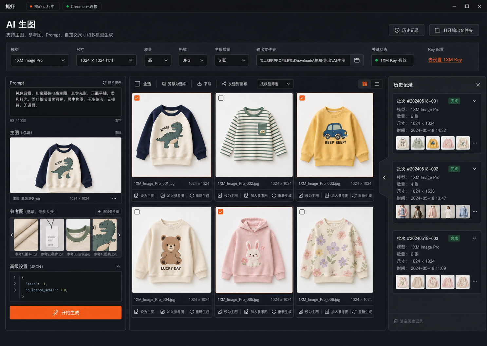

# 抓虾 AI 生图工作台设计

## 背景

抓虾已经在 `巴拉-AI测图全链路` 中接入 1XM 生图能力，但那条链路服务于天猫测图业务：它绑定森马云盘找图、提示词库、天猫素材上传、测图任务创建和审批看板。

本设计新增一个独立 `AI 生图` 工作台入口，把 1XM 图片生成能力抽成通用工作台。它面向日常商品图、海报图、参考图融合、Prompt 调试、批量前的单图试验和后续自由画布迭代，不依赖任何具体平台适配器，也不绑定 `task_instances`。

## 目标

1. 新增 `AI 生图` 入口，入口放在 `任务中心` 下方；进入页面后切换为无全局左侧菜单栏的焦点工作台。
2. 复用现有 1XM 后端调用能力，支持：
   - `gpt-image-2`
   - `gemini-3.1-flash-image-preview`
   - `gemini-3-pro-image-preview`
3. 支持高自由度参数：
   - Prompt
   - 自定义尺寸
   - 质量
   - 输出格式
   - 生成张数
   - 主图
   - 参考图
   - 高级 JSON
4. 生成结果进入用户设置的本地图片文件夹，支持历史回看、复用、重新生成和后续画布编辑。
5. API Key 由本机设置页配置，不引入抓虾积分或额度扣减。
6. 自由画布能力借鉴 Cowart/tldraw 的产品结构，但在抓虾内隔离实现，不直接把 Cowart 插件整体并入主应用。

## 非目标

1. 第一版不接入抓虾积分、余额、套餐、内部扣费或计费系统。
2. 第一版不改造 `巴拉-AI测图全链路` 的业务流程。
3. 第一版不把 AI 生图工作台放进 `任务中心` 的任务实例模型。
4. 第一版不直接引入完整 Cowart React 应用到 Vue/Electron 主界面。
5. 第一版不做云端账号协作、素材云存储或团队共享。

## 产品入口

`App.vue` 继续使用当前 `currentView` 机制：

- `scripts`：我的脚本。
- `task_center`：任务中心。
- `ai_image`：AI 生图。
- `files`：数据文件。
- `settings`：设置。

导航/入口顺序：

1. 我的脚本
2. 任务中心
3. AI 生图
4. 数据文件
5. 设置

`AI 生图` 使用与当前抓虾一致的深色工具型视觉、橙色 active 状态和紧凑字号。进入 `AI 生图` 后采用焦点工作台模式：不展示全局左侧菜单栏，让生图参数、结果管理和历史抽屉占满主窗口宽度。页面不是营销页，也不是脚本卡片列表，而是一个长期驻留的创作工作台。

## UI 设计

视觉锚点采用方案 3 的批量结果管理风格：



已确认的 UI 方向为无全局侧栏的三层工作台：

1. 顶部：抓虾标题栏、核心/Chrome 状态、页面标题、副标题、历史记录和打开输出文件夹。
2. 中部：横向参数 ribbon，承载模型、尺寸、质量、格式、生成数量、输出文件夹、Key 状态和 `去设置 1XM Key`。
3. 主体：左侧 Prompt/素材面板 + 中央批量结果区 + 右侧历史抽屉。

不展示全局左侧菜单栏；左侧只保留 `AI 生图` 自己的 Prompt/素材参数面板。素材放到 Prompt 输入框下方；`本次输出` 列表取消，输出图直接在结果/画布工作区选择、下载或另存为。历史记录使用右侧抽屉，默认可以半展开或收起，不作为全局导航。

整体延续当前抓虾视觉：

- 背景：`#141418` / `#1c1c22` / `#242430`。
- 边框：`#2e2e3a`。
- 主强调色：`#FF6B2B`。
- 控件圆角：约 8px。
- 字号：以 12px-14px 为主。
- 布局：密集、克制、适合高频操作。

### 页面头部与参数 ribbon

页面头部包含：

- 标题：`AI 生图`
- 副标题：`支持主图、参考图、Prompt、自定义尺寸和多模型生成`
- 右侧按钮：
  - `历史记录`
  - `打开输出文件夹`

页面头部不放 `开始生成`。`历史记录` 打开右侧历史抽屉；`打开输出文件夹` 打开当前选择的输出文件夹。

页面头部下方增加横向参数 ribbon：

1. 模型。
2. 尺寸。
3. 质量。
4. 格式。
5. 生成数量。
6. 输出文件夹。
7. Key 状态。
8. `去设置 1XM Key`。

输出文件夹在 ribbon 中显示完整或截断路径，默认路径需要展示 Windows 兼容示例：`%USERPROFILE%\Downloads\抓虾导出\AI生图`。

### 左侧 Prompt 与素材面板

左侧工作台面板固定宽度约 340px-380px，它不是全局菜单栏，只服务当前 `AI 生图` 页面。面板包含：

1. Prompt 输入。
2. 素材区：主图和参考图。
3. 高级 JSON。
4. 固定底部操作区。

素材区紧跟在 Prompt 输入框下方，减少从右侧找素材的视线跳转。素材区包含：

- 主图：最多 1 张，标记为 `主图`，用于主体保持、商品参考或图生图。
- 参考图：多张，按拖拽顺序进入 1XM payload。
- 重新上传、删除、预览和设定角色。
- 从结果图回填为主图或参考图。

输出文件夹是一个明确字段，主展示位在参数 ribbon 中：

- 默认使用系统下载目录下的 `抓虾导出/AI生图`，并按当前系统生成兼容路径：
  - macOS / Linux：`~/Downloads/抓虾导出/AI生图`
  - Windows：`%USERPROFILE%\Downloads\抓虾导出\AI生图`
- 用户可以选择任意本地文件夹。
- 所有生成图直接保存到该文件夹。
- 元数据、日志和输入素材归档放到该文件夹下的隐藏或子目录中，不影响用户直接查看输出图。

左侧面板固定底部操作区包含：

- 主按钮：`开始生成`。
- 次级状态：当前模型、生成数量、输出目录是否已设置。
- 配置缺失时显示 `去设置 1XM Key`，点击后直接跳转到设置页并定位到 `1XM 图片模型` 配置区。

模型选择默认提供：

| 模型 | 默认定位 | UI 说明 |
| --- | --- | --- |
| `gpt-image-2` | 通用文生图、图生图、产品图、海报图 | 稳定通用 |
| `gemini-3.1-flash-image-preview` | 快图、轻商品图、批量试验 | 快速 |
| `gemini-3-pro-image-preview` | 高质量、多参考图融合、复杂构图 | 高质量 |

尺寸设置支持两种输入方式：

- 快捷比例：`1:1`、`3:4`、`4:3`、`16:9`、`9:16`。
- 自定义宽高：用户输入 width 和 height。

后端按模型做尺寸校验或归一化：

- `gpt-image-2`：优先使用 `1024x1024` 这类宽高字符串，保留 `size`、`quality`、`output_format`、`n`。
- Gemini 图片模型：优先接受比例或兼容尺寸；若用户输入精确宽高，后端会生成对应的 `size` 字段，并在模型不支持时返回清晰错误。

高级 JSON 只允许覆盖白名单字段，例如：

- `webhook_url`
- `webhook_secret`
- `seed`，如果 1XM 当前模型支持
- 未来新增的模型参数

高级 JSON 不允许覆盖：

- `Authorization`
- API Key
- 本地路径安全策略
- 系统生成的幂等键

### 中央批量结果区

中央区域是主工作区，默认打开 `结果` tab。

顶部显示本次生成摘要：

- 模型
- 尺寸
- 数量
- 状态
- 耗时

结果区显示生成图片网格：

- 多图时使用 2 列或 3 列网格，方案 3 默认展示 6 张商品图。
- 网格卡片以图片为主体，选中态使用橙色边框和勾选框。
- 支持勾选图片，进入批量操作模式。
- 每张图显示：
  - 缩略图
  - 模型
  - 尺寸
  - 状态
  - 下载
  - 另存为
  - 设为主图
  - 加入参考图
  - 发送到画布
  - 重新生成

批量操作支持：

- 全选。
- 保存选中到当前输出文件夹。
- 另存为到用户选择的本地目录。
- 发送选中图片到画布。
- 删除本次记录，默认不删除本地图片文件。

结果网格是第一版默认主视图。`画布` 和 `日志` 不再强制放到底部 tab 中：

- `画布` 可以作为结果工具栏中的 `发送到画布` 后进入的工作区模式，或作为后续阶段的独立抽屉/面板。
- `日志` 可以作为底部细日志条或可展开日志抽屉，默认只显示 task id、poll 状态和本地保存状态。

`日志` 展示 1XM task id、poll URL、轮询状态、图片保存状态和错误信息，但不展示完整 base64 data URL。

### 大图二次修改与精准标注

结果卡片提供两种二次修改入口：

1. 结果图片卡片底部操作区增加 `修改` 按钮。
2. 点击结果图片进入大图预览后，右侧固定显示修改对话框。

大图预览采用左图右对话框：

- 左侧是当前图片的大图区域，并嵌入 tldraw 标注层。
- 右侧显示此次生图 Prompt、新的修改提示词、参考图上传入口和提交按钮。
- 底部新增缩略图预览条，第一张始终是原始选中图，后续是本次大图页内产生的修改结果。
- 点击缩略图可以在原图和修改结果之间切换，继续对当前选中的图片做下一轮修改。

二次修改任务的生成规则：

- 默认只生成 1 张图，强制写入 `params.n = 1`，不继承左侧普通生图的多图数量。
- 模型、比例、尺寸、质量、格式、输出目录和高级 JSON 沿用当前任务/原图对应配置。
- 选中的结果图先 materialize 为本地输入图，再作为主图传给 1XM。
- 右侧上传的参考图会作为 reference image 传入。
- tldraw 导出的 `原图 + 标注` PNG 会通过 `/ai-image/jobs/{job_uid}/materialize` 的 `data_url` 分支落成本地缓存文件，再作为额外参考图传入模型。

提交后的交互状态：

- 大图页不关闭。
- 底部缩略图预览条立即追加一张 `修改中` 占位图。
- 占位图使用当前选中图的模糊预览作为背景，并叠加旋转加载状态。
- 后端生成完成后，用真实结果替换占位图，并自动切换到这张新结果。
- 生成失败时移除占位图，保留原图和用户输入，错误显示在右侧修改面板内。

tldraw 集成边界：

- 不引入完整 Cowart React 应用，只把 `tldraw`、`react`、`react-dom` 和 `@tldraw/assets` 作为客户端依赖打包。
- Vue 工作台负责任务、表单、IPC/API 和 lightbox 状态；tldraw 仅作为局部 React island 承担标注与截图导出。
- 标注层默认提供画笔、箭头、文字和清除能力。
- 导出时使用 `editor.toImageDataUrl(...)` 将原图 shape 和标注 shape 一起 rasterize 为 PNG。

拖拽复用交互：

- 结果卡片和结果图片预览按钮本身都支持拖拽。
- 用户可以从图片任意可见区域开始拖动，把生成结果拖到左侧 `主图` 或 `参考图` 槽位。
- 远程 URL 结果在进入输入槽位前会先 materialize 到本地缓存，避免后续图生图只能拿到不可控远程链接。

### 历史与输出

历史记录采用方案 3 的右侧抽屉形态：默认从右侧边缘展开，支持收起为窄条，不展示为全局侧边栏。

历史支持：

- 最近生成任务。
- 按模型筛选。
- 按状态筛选。
- 点击历史任务恢复参数与结果。
- 打开任务对应的输出文件夹。

输出不再展示独立 `本次输出` 列表。用户在 `结果` 或 `画布` tab 中直接查看生成图，并通过单图下载、批量勾选、另存为或打开输出文件夹完成文件操作。

## 模型与 1XM 调用

所有模型默认走 1XM 异步任务接口：

```text
POST /images/tasks
GET /images/tasks/{task_id}
```

原因：

1. 4K、多参考图、图片编辑和多图输出更容易超过同步请求等待时间。
2. 前端刷新后可以通过保存的 task id 恢复状态。
3. 已有抓虾 1XM 客户端具备异步轮询、幂等键、重试和超时能力。

### Payload 映射

`gpt-image-2`：

```json
{
  "model": "gpt-image-2",
  "prompt": "...",
  "size": "1024x1024",
  "quality": "high",
  "output_format": "png",
  "n": 1,
  "image": ["data:image/png;base64,..."]
}
```

`gemini-3.1-flash-image-preview`：

```json
{
  "model": "gemini-3.1-flash-image-preview",
  "prompt": "...",
  "size": "3:4",
  "quality": "2K",
  "image": ["data:image/png;base64,..."]
}
```

`gemini-3-pro-image-preview`：

```json
{
  "model": "gemini-3-pro-image-preview",
  "prompt": "...",
  "size": "16:9",
  "quality": "4K",
  "image": [
    "data:image/png;base64,...",
    "data:image/jpeg;base64,..."
  ]
}
```

Gemini 图片模型通常按单任务生成 1 张图处理。如果用户要求多张图，后端创建多个异步任务，每个任务使用不同的幂等键。

### 幂等键

幂等键由后端生成，不接受前端直接传入完整值。

推荐格式：

```text
ai_image_<job_uid>_<index>_<attempt>
```

同一次网络重试使用同一幂等键。用户主动点击 `重新生成` 时生成新的幂等键。

### 参考图顺序

后端将素材按角色排序后转成 data URL：

1. 主图。
2. 参考图，按用户拖拽顺序。
3. 画布导出图。

角色信息保存在 `ai_image_assets.meta_json`，1XM payload 只接收 data URL 数组。

## API Key 与费用边界

AI 生图不消耗抓虾积分，也不接入内部积分扣减。

用户在设置页配置 1XM API Key。后端运行时读取本机配置或环境变量，并直接使用该 Key 调用 1XM。

设置页保持服务端配置边界：

- Base URL：`ai.1xm.base_url`
- GPT Image 2 2K Key：`ai.1xm.gpt_image_2k_key`
- GPT Image 2 4K Key：`ai.1xm.gpt_image_4k_key`
- Gemini 3.1 Flash Image Preview Key：`ai.1xm.gemini_3_1_flash_image_preview_key`
- Gemini 3 Pro Image Preview Key：`ai.1xm.gemini_3_pro_image_preview_key`

设置页标题从 `1XM GPT-Image-2` 调整为 `1XM 图片模型`。其中 `ai.1xm.gpt_image_2k_key` 和 `ai.1xm.gpt_image_4k_key` 只服务 `gpt-image-2`；Gemini 两个图片模型必须使用各自独立 Key 字段，避免与 GPT Image 2 的 2K/4K Key 混用。

Key 选择规则：

1. `gpt-image-2`：用户显式选择 2K 或 4K 档位时，使用 `ai.1xm.gpt_image_2k_key` 或 `ai.1xm.gpt_image_4k_key`。
2. `gpt-image-2`：用户选择自动时，后端根据尺寸和质量选择 2K/4K 档位。
3. `gemini-3.1-flash-image-preview`：始终使用 `ai.1xm.gemini_3_1_flash_image_preview_key`。
4. `gemini-3-pro-image-preview`：始终使用 `ai.1xm.gemini_3_pro_image_preview_key`。
5. 若当前模型对应 Key 未配置，则返回明确错误：`设置菜单未配置 1XM 图片模型 API Key`，并携带缺失的配置项 ID 供前端定位。
6. 渲染进程不直接调用 1XM，不把 API Key 放入 job payload、日志或截图中。

## 后端 API

新增通用 API，不挂在平台 adapter 下。

### 任务

```text
GET    /ai-image/jobs
POST   /ai-image/jobs
GET    /ai-image/jobs/{job_uid}
POST   /ai-image/jobs/{job_uid}/run
POST   /ai-image/jobs/{job_uid}/rerun
POST   /ai-image/jobs/{job_uid}/stop
POST   /ai-image/jobs/{job_uid}/save-as
DELETE /ai-image/jobs/{job_uid}
```

`POST /ai-image/jobs` 创建草稿或创建并运行，取决于请求中的 `run` 字段。

`POST /ai-image/jobs/{job_uid}/run` 负责：

1. 读取 job 参数。
2. 读取素材路径。
3. 转 data URL。
4. 构造一个或多个 1XM 异步任务。
5. 轮询任务完成。
6. 下载结果图片到用户设置的本地图片文件夹。
7. 写入 job summary、asset rows 和日志。

`POST /ai-image/jobs/{job_uid}/save-as` 负责把用户勾选的输出图复制到指定本地目录：

```json
{
  "asset_uids": ["..."],
  "target_dir": "/Users/name/Desktop/selected-ai-images"
}
```

该接口只复制本地已存在的输出图，不重新请求 1XM，不改变原始输出文件夹。

### 素材

```text
POST   /ai-image/assets
GET    /ai-image/assets/{asset_uid}
GET    /ai-image/assets/{asset_uid}/file
PATCH  /ai-image/assets/{asset_uid}
DELETE /ai-image/assets/{asset_uid}
```

`POST /ai-image/assets` 支持：

- 本地路径导入。
- 生成结果转素材。
- 画布导出转素材。

Electron 下通过 `browseFile` / `browseDirectory` 选择文件。浏览器开发模式可先用手输本地路径兜底。

### 画布

```text
GET    /ai-image/canvases
POST   /ai-image/canvases
GET    /ai-image/canvases/{canvas_uid}
PATCH  /ai-image/canvases/{canvas_uid}
POST   /ai-image/canvases/{canvas_uid}/export-selection
POST   /ai-image/canvases/{canvas_uid}/insert-asset
```

第一版先做轻量画布数据表和 `画布` tab 基础能力；完整自由画布在下一阶段接入。

## 数据模型

新增 SQLite 表。

### ai_image_jobs

| 字段 | 说明 |
| --- | --- |
| `id` | 自增 ID |
| `job_uid` | 业务 UID |
| `title` | 任务标题 |
| `status` | `draft`、`queued`、`running`、`succeeded`、`partial_failed`、`failed`、`stopped` |
| `model` | 1XM 模型 ID |
| `prompt` | 最终 Prompt |
| `negative_prompt` | 预留字段 |
| `size` | 原始尺寸字段，例如 `1024x1024` 或 `3:4` |
| `width` | 自定义宽 |
| `height` | 自定义高 |
| `quality` | `auto`、`low`、`medium`、`high`、`1K`、`2K`、`4K` |
| `output_format` | `png`、`jpeg`、`webp` |
| `count` | 用户请求张数 |
| `key_tier` | `auto`、`2k`、`4k` |
| `params_json` | 结构化参数 |
| `advanced_json` | 高级 JSON |
| `summary_json` | task ids、poll urls、结果数量、耗时 |
| `error` | 错误信息 |
| `output_dir` | 用户设置的本地图片输出文件夹 |
| `created_at` | 创建时间 |
| `updated_at` | 更新时间 |
| `completed_at` | 完成时间 |

### ai_image_assets

| 字段 | 说明 |
| --- | --- |
| `id` | 自增 ID |
| `asset_uid` | 素材 UID |
| `job_uid` | 关联 job，可为空 |
| `canvas_uid` | 关联 canvas，可为空 |
| `role` | `main`、`reference`、`output`、`canvas_export` |
| `source_type` | `local`、`generated`、`canvas` |
| `local_path` | 本地文件路径 |
| `source_path` | 原始导入路径 |
| `remote_url` | 1XM 返回 URL |
| `filename` | 文件名 |
| `mime_type` | MIME |
| `width` | 图片宽 |
| `height` | 图片高 |
| `sha256` | 去重与追踪 |
| `sort_order` | 参考图顺序 |
| `meta_json` | 模型、task id、role note |
| `created_at` | 创建时间 |

### ai_image_canvases

| 字段 | 说明 |
| --- | --- |
| `id` | 自增 ID |
| `canvas_uid` | 画布 UID |
| `title` | 画布标题 |
| `document_json` | 画布节点数据 |
| `thumbnail_path` | 画布缩略图 |
| `created_at` | 创建时间 |
| `updated_at` | 更新时间 |

## 本地输出文件夹

默认输出文件夹：

```text
macOS / Linux: ~/Downloads/抓虾导出/AI生图
Windows: %USERPROFILE%\Downloads\抓虾导出\AI生图
```

用户也可以在参数 ribbon 中选择任意本地文件夹。生成图直接保存到这个文件夹，方便用户在 Finder 或 Windows 资源管理器中直接查看，不需要先进入某个任务子目录。

文件结构：

```text
AI生图/
  gpt-image-2_20260702-153012_001.jpg
  gpt-image-2_20260702-153012_002.jpg
  gemini-3-pro_20260702-153512_001.png
  .crawshrimp-ai-image/
    jobs/
      <job_uid>/
        inputs/
          main/
          references/
        canvas/
          selection-1.png
        job.json
        logs.txt
```

输出图片命名规则：

```text
<model_slug>_<yyyymmdd-hhmmss>_<index>.<ext>
```

同名冲突时追加短 hash。`另存为` 不改变原始输出文件，只把用户勾选的图片复制到目标目录。

`job.json` 保存：

- job 参数。
- 模型。
- Prompt。
- 高级 JSON。
- 主图/参考图角色。
- 1XM task id。
- poll URL。
- 结果 URL。
- 本地输出路径。
- 输出文件夹。
- 错误信息。

## 自由画布

自由画布借鉴 Cowart 的产品结构：

- 图片节点。
- AI image holder。
- 画框。
- 标注。
- 选区导出。
- 生成结果回填。

但实现上保持隔离：

1. `AI 生图` 页面先保留 `画布` tab。
2. 画布内部可以使用独立组件或 iframe/micro-app 承载，避免污染主 Vue 应用。
3. 画布数据写入 `ai_image_canvases`。
4. 图片资产仍统一写入 `ai_image_assets`。
5. 选中画布节点后可以执行：
   - 设为主图。
   - 加入参考图。
   - 导出选区作为参考图。
   - 将生成结果插入画布。

第一阶段可实现轻量画布：

- 资产拖入工作区。
- 图片自由排列。
- 选择图片并设定角色。
- 生成结果插入工作区。

第二阶段再引入完整 tldraw 级交互：

- 无限画布。
- 多选。
- AI holder。
- 标注层。
- 选区导出。
- 快照恢复。

## 结果二次修改交互补充

2026-07-09 补充：生成结果区需要支持从结果图直接进入二次编辑，不要求用户先手动复制结果到左侧素材区。

入口：

1. 结果卡片 footer 新增 `修改` 按钮。
2. 点击结果图片仍进入大图预览；大图预览改成左图右面板结构。

大图右侧修改面板：

- 顶部显示当前结果图标签。
- 先展示本次生成该图时使用的 Prompt。
- 提供 `新的修改提示词` 输入框。
- 提供参考图上传入口，允许给这次二次修改额外补参考图。
- 提交二次修改时，当前选中结果图自动作为主图，右侧上传的图片并入参考图，新的提示词写回当前任务并复用现有生成流程追加一轮结果。
- 原始结果图和历史队列不覆盖，新结果追加到新一轮队列。

拖拽复用：

- 已生成结果图支持鼠标按住拖动。
- 拖到左侧 `主图` 区域时，视为 `设为主图`。
- 拖到左侧 `参考图` 区域时，视为 `设为参考`。
- 桌面 Electron 环境可用 HTML5 drag/drop 实现；如果后续需要触屏长按拖动，需要补 pointer events 长按识别，因为移动端浏览器对原生 drag/drop 支持不稳定。
- 远程 URL 结果拖入素材区时仍走现有物化流程，先缓存成本地文件再进入主图/参考图，避免后续模型 payload 依赖不可控远程 URL。

Cowart 标注结论：

- Cowart 的实现核心是 tldraw 无限画布：图片、箭头、文字、AI 图片框都作为形状存在，画布和资源写入项目目录下的 `canvas/pages/<page-id>/`。
- Cowart 的 `按标注修改` 不是把每个箭头单独转结构化 JSON，而是导出一张包含原图、箭头、标注文字和局部上下文的标注截图，再把截图与提示词一起发送给 Codex/模型。
- 这个思路可以迁移到抓虾大图修改框：第一阶段先支持把标注截图作为参考图上传，配合新的修改提示词发起精准修改；第二阶段再在右侧面板内嵌轻量 tldraw/独立画布组件，导出“原图 + 标注层”的截图，并把截图路径写入 `ai_image_assets.meta_json`。
- 不建议第一阶段直接把完整 Cowart React 应用并入当前 Vue/Electron 主界面；更稳的路线是保留抓虾 `AiImageWorkbench.vue` 的二次编辑流程，把完整 tldraw 标注作为隔离组件或后续 `ai_image_canvases` 能力接入。

## 错误处理

### 配置缺失

未配置 API Key 时：

- 前端显示 `去设置 1XM Key`。
- 点击 `去设置 1XM Key` 后直接切到 `设置` 页面，并定位到 `1XM 图片模型` 配置区。
- 后端返回明确错误。
- 不创建 1XM task。
- 不写入失败输出图。

### 参考图读取失败

单张参考图读取失败时：

- job 标记为 `failed` 或 `partial_failed`，取决于是否还有可执行生成任务。
- 错误写入 job summary 和 logs。
- UI 在对应素材上显示失败状态。

### 单图生成失败

多图生成时，单张失败不阻断其他图片：

- 成功图片正常归档。
- 失败图片记录错误原因。
- job 状态为 `partial_failed`。

### 轮询超时

轮询超时保留：

- task id。
- poll URL。
- 幂等键。
- 当前状态。

用户可以点击 `继续轮询` 或 `重新生成`。

## 安全与隐私

1. API Key 只保存在本机配置或环境变量中。
2. 前端不直接调用 1XM。
3. 日志不打印完整 data URL。
4. 本地文件导入必须校验路径存在、图片格式和大小。
5. 输出文件夹只写入用户可见位置或抓虾数据目录下的安全子目录。
6. 删除历史任务默认只删除数据库记录；删除本地文件需要用户二次确认。

## 与任务中心的关系

`AI 生图` 是独立工作台，不属于 `任务中心`。

原因：

1. 生图工作台是持续创作空间，不是一次性业务脚本实例。
2. 它需要资产板、画布、历史复用和参数恢复。
3. `task_instances` 当前更适合平台业务任务，例如天猫 AI 测图、数据抓取定时任务。

后续如果需要批量生图，可以在 `AI 生图` 内部新增 batch job，而不是复用 adapter task instance。

## 测试计划

后端测试：

1. 初始化 SQLite 创建 `ai_image_jobs`、`ai_image_assets`、`ai_image_canvases`。
2. 创建、列表、详情、删除 job。
3. 创建和更新 asset role。
4. 模型 payload 映射正确。
5. `gpt-image-2` 只读取 `ai.1xm.gpt_image_2k_key` / `ai.1xm.gpt_image_4k_key`，不读取 Gemini Key。
6. Gemini 两个模型分别读取独立 Key，不复用 GPT Image 2 的 2K/4K Key。
7. 默认输出文件夹能在 macOS/Linux 和 Windows 上生成兼容路径。
8. 多图生成按数量创建多个 1XM task。
9. 单图失败不阻断其他图。
10. 结果 URL 下载到用户设置的本地图片文件夹。
11. `save-as` 接口能把勾选输出图复制到目标目录，且不改动原始输出文件。
12. `job.json` 不包含完整 data URL 或 API Key。

前端测试：

1. 一级导航显示 `AI 生图`，并位于 `任务中心` 下方。
2. `AI 生图` active 状态使用橙色。
3. 页面渲染为无全局左侧菜单栏的焦点工作台。
4. 素材区位于 Prompt 输入框下方。
5. 顶部参数 ribbon 中的模型选择、尺寸、质量、格式、生成数量、输出文件夹和 Key 状态可更新。
6. 主图/参考图上传入口渲染。
7. `开始生成` 固定在左侧面板底部。
8. 开始生成时调用 `/ai-image/jobs` 和 run API。
9. 生成中显示进度，完成后显示结果图。
10. 结果图支持勾选、批量另存为和打开输出文件夹。
11. 历史记录可以恢复参数。
12. 配置缺失时显示 `去设置 1XM Key`。
13. 点击 `去设置 1XM Key` 后直接跳转设置页并定位到 `1XM 图片模型` 配置区。

浏览器或 Electron 检查：

1. 5173 开发页可打开 `AI 生图`。
2. Electron 抓虾进入 `AI 生图` 后不展示全局左侧菜单栏。
3. 未配置 API Key 时不会真实调用 1XM。
4. 设置页能分别保存 GPT Image 2 2K/4K Key、Gemini Flash Key 和 Gemini Pro Key。
5. 配置对应模型 Key 后可完成一张测试图生成。
6. 生成结果在用户设置的本地图片文件夹可打开。

## 实施阶段

### 阶段 1：工作台壳与设置边界

- 新增 `AI 生图` 一级导航。
- 新增 `AiImageWorkbench.vue`。
- 设置页新增 `1XM 图片模型` 配置区，保留 GPT Image 2 2K/4K Key，并新增 Gemini Flash / Gemini Pro 独立 Key。
- UI 完成无全局侧栏焦点工作台、顶部参数 ribbon、左侧 Prompt/素材面板、固定底部生成按钮、中央批量结果区和右侧历史抽屉。

### 阶段 2：后端 job 与 asset 模型

- 新增 SQLite 表。
- 新增 `/ai-image/jobs` 与 `/ai-image/assets` API。
- 新增 Electron preload/main IPC 与 dev bridge。
- 支持草稿保存和历史恢复。

### 阶段 3：1XM 异步生成闭环

- 通用化当前 1XM payload 构造。
- 支持三类模型。
- 支持主图/参考图 data URL 转换。
- 支持多图任务、幂等键、轮询、失败记录和本地输出文件夹保存。

### 阶段 4：结果管理

- 结果图预览、下载、勾选、批量另存为、打开文件、设为主图、加入参考图、重新生成。
- 历史任务恢复参数。
- 输出 `job.json` 和 `logs.txt`。

### 阶段 5：轻量画布

- `画布` tab。
- 图片节点排列。
- 设为主图/参考图。
- 生成结果回填。
- 画布数据保存到 `ai_image_canvases`。

### 阶段 6：完整自由画布

- 隔离接入 tldraw 级画布能力。
- AI image holder。
- 选区导出。
- 标注层。
- 画布快照与恢复。

## 验收标准

1. `AI 生图` 使用方案 3 作为视觉锚点，进入页面后不展示全局左侧菜单栏。
2. 页面视觉与当前抓虾暗色桌面 UI 保持一致。
3. 用户可以在设置页配置 1XM 图片模型 API Key，不需要配置抓虾积分。
4. GPT Image 2 使用 2K/4K Key，Gemini Flash / Gemini Pro 使用各自独立 Key。
5. 未配置当前模型 Key 时，生图按钮显示 `去设置 1XM Key`，点击后直接跳转设置页对应配置区，不消耗任何额度。
6. 用户可以选择三种模型之一。
7. 用户可以输入 Prompt、自定义尺寸、质量、格式和生成数量。
8. 用户可以上传主图和参考图。
9. 后端通过 1XM `/images/tasks` 创建异步任务。
10. 默认输出目录同时兼容 macOS/Linux 和 Windows。
11. 生成结果保存到用户设置的本地图片文件夹。
12. 历史记录可恢复参数和结果。
13. 单张失败不会吞掉成功结果，错误原因可见。
14. 日志和 `job.json` 不包含 API Key 或完整 data URL。
15. 画布 tab 可承载后续自由画布能力，不阻塞第一版通用生图闭环。

## 参考资料

- 1XM GPT-Image-2 图片 API：https://1xm.ai/docs/api/gpt-image-2.html
- 1XM Nano Banana 图片 API：https://1xm.ai/docs/api/nano-banana.html
- Cowart：https://github.com/zhongerxin/cowart
- Adobe Firefly：https://www.adobe.com/products/firefly.html
- Recraft：https://www.recraft.ai/
- Magnific / Freepik AI Image Generator：https://www.magnific.com/ai/image-generator
