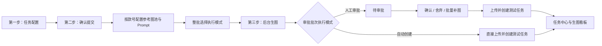

# 天猫 AI 生图款号参考图池与审批批次执行设计

**日期：** 2026-07-23

**状态：** 已确认，待实施计划

**适用范围：** `tmall-ops-assistant / tmall_ai_image_test_chain`、AI 生图工作台、第二步确认提交、任务中心、生图看板和 Electron 系统通知

## 1. 背景

当前 AI 生图工作台会自动抓取平台素材作为参考图，但创意拍、组合拍还需要用户自己的本地素材。现有链路虽然在第二步已有本地多图导入、款号参考图池和逐 Prompt 选图的部分底层能力，但没有形成完整、稳定、可恢复的产品流程。

同时存在以下关联问题：

- `direct_create` 当前会跳过第二步，用户无法在自动创建模式下确认 Prompt 和参考素材。
- 选择云端 Prompt 库后，实际值已经保存，但界面主文案仍像“未选择”，批次恢复时也可能只剩 ID。
- 从首页脚本或自动审批链路进入的任务没有始终形成可查看的任务中心实例。
- 生图、审批和测试任务创建共用一个粗粒度结果，容易出现“测试任务没有创建但整批显示成功”。
- 关闭二次修改界面可能被误解或处理为停止后台生成。
- 审批确认、舍弃只改变轻微透明度，缺乏明确反馈；全部舍弃后也缺少批量补充生图。
- 等待登录、确认提交、等待审批等人工节点缺少足够醒目的跨平台提醒。

本设计在不修改云端 Prompt 库结构的前提下，将第二步审批批次设为后续执行的唯一配置快照，并把参考图、Prompt、执行模式和任务状态统一关联起来。

## 2. 目标

1. 在第二步按款号建立独立的自定义参考图池。
2. Prompt 名称包含“创意拍”或“组合拍”时，默认使用该款全部自定义参考图，同时允许用户逐条取消或重选图片。
3. 自定义参考图全部可选；未上传时继续使用系统抓取素材。
4. 人工审批和自动创建两种模式都经过第二步，并以审批批次中的整批模式为准。
5. Prompt 支持查看明细、修改本批次版本和重新选择，且不意外修改云端原始模板。
6. 任务退出页面后继续在后台运行，并能从任务中心、生图看板和审批批次恢复。
7. 生图、审批、测试任务创建分别记录真实状态，避免错误的成功标识。
8. 为 macOS 提供系统横幅，为 Windows 提供右下角系统 Toast，提醒需要人工参与的步骤。

## 3. 非目标

- 不给 Prompt 库新增“创意拍/组合拍”场景字段。
- 不做 Prompt 语义分类或 AI 自动识别，只匹配最终 Prompt 名称中的固定关键词。
- 不允许把一个款号的参考图一键应用到整批其他款号。
- 不重新建设独立的图片上传系统，优先复用现有第二步多图导入与预览能力。
- 不把本批次的临时 Prompt 修改直接写回云端 Prompt 库。
- 不用自绘常驻浮窗替代 macOS、Windows 的系统通知。

## 4. 已确认的产品决策

| 决策项 | 结论 |
|---|---|
| 参考图组织 | 按款号建立独立参考图池 |
| 生效基准 | 以第二步确认提交生成的审批批次为准 |
| 参考图必填性 | 全部可选；缺少时使用系统抓取素材 |
| Prompt 识别 | 名称包含“创意拍”或“组合拍” |
| 默认应用 | 自动应用到该款匹配 Prompt，用户可逐条取消 |
| 执行模式 | 整批统一单选 |
| 模式位置 | 从第一步移动到第二步 |
| Prompt 库结构 | 不新增场景字段 |
| Prompt 操作 | 支持查看明细、修改本次、重新选择 |
| macOS 通知 | 系统横幅 |
| Windows 通知 | 右下角系统 Toast |

## 5. 总体流程

所有任务统一经过四步：

1. **任务配置**
   - 导入款号或选择商品。
   - 选择云端 Prompt 库。
   - 配置基础生图参数。
   - 不在此处选择执行模式。
2. **确认提交**
   - 按款号展示 Prompt。
   - 管理该款自定义参考图池。
   - 检查和调整 Prompt 与参考图绑定。
   - 整批选择执行模式。
   - 确认后冻结审批批次快照。
3. **后台生图**
   - 只读取审批批次快照。
   - 页面、抽屉或弹窗关闭后继续执行。
   - 结果同步到任务中心和生图看板。
4. **审批或自动创建**
   - 人工模式进入待审批，确认后上传并创建测试任务。
   - 自动模式不阻塞在审批页，直接上传并创建测试任务。
   - 两种模式都保留可查看的图片结果。



## 6. 第二步页面设计

### 6.1 页面结构

第二步由三部分组成：

1. 顶部批次配置区：云端 Prompt 库、整批执行模式和批次统计。
2. 中部按款号配置区：款号参考图池、Prompt 列表和逐条操作。
3. 底部固定提交栏：执行摘要、校验结果和确认按钮。

```text
┌──────────────────────────────────────────────────────────────┐
│ 第二步：确认提交                    共 12 个款号 / 48 条 Prompt │
├──────────────────────────────────────────────────────────────┤
│ Prompt 库：鞋品创意拍模板库              [查看内容] [更换]     │
│ 执行模式： ● 生图后人工审批  ○ 生图后直接创建测试任务          │
├──────────────────────────────────────────────────────────────┤
│ 款号搜索 [____________]             [展开全部] [收起全部]      │
├──────────────────────────────────────────────────────────────┤
│ ▼ 款号 208426106201                 4 条 Prompt / 3 张参考图   │
│ 自定义参考图池（可选）                                       │
│ [＋上传参考图] [图1 ×] [图2 ×] [图3 ×]                      │
│                                                              │
│ ☑ 创意拍-户外场景      自定义参考图：[图1][图2]               │
│    [查看明细] [修改本次] [重新选择]                           │
│ ☑ 组合拍-鞋服搭配      自定义参考图：[图1][图2][图3]          │
│    [查看明细] [修改本次] [重新选择]                           │
│ ☐ 商品白底图           仅使用系统抓取素材                     │
├──────────────────────────────────────────────────────────────┤
│ ▶ 款号 208426106202                 3 条 Prompt / 未上传参考图 │
├──────────────────────────────────────────────────────────────┤
│ 12 个款号 · 48 条 Prompt · 15 条使用自定义参考图               │
│                                      [返回修改] [确认并开始]   │
└──────────────────────────────────────────────────────────────┘
```

### 6.2 按款号建立参考图池

- 每个款号独立上传、预览、追加和删除图片。
- 同一款号的多条 Prompt 可以复用同一张图片。
- 图片不得跨款号自动共享。
- 删除正在使用的图片时先明确提示；确认后同步解除所有关联。
- 没有自定义参考图时，Prompt 正常使用系统抓取素材，不报错、不阻止提交。
- 批量款号用折叠卡片展示，并支持搜索、展开全部、收起全部及定位配置异常。

不提供“应用到全部款号”，避免商品素材错配。

### 6.3 Prompt 自动匹配与绑定

首次上传该款自定义参考图时：

- 最终 Prompt 名称包含“创意拍”或“组合拍”的条目默认勾选。
- 默认绑定该款参考图池中的全部图片。
- 用户可以逐条取消“使用该款自定义参考图”。
- 不匹配的 Prompt 默认只使用系统抓取素材。

追加图片时：

- 从未被人工修改的自动绑定项，自动追加新图片。
- 已被人工修改的绑定项保持原选择，并提示用户自行调整。

删除图片时：

- 从所有关联 Prompt 中同步解除。
- 如果某条 Prompt 不再有自定义参考图，回退为仅使用系统抓取素材。

重新选择 Prompt 时：

- 保留该款参考图池。
- 未人工调整过的条目按新名称重新判断。
- 已人工调整过的条目保留当前绑定，并显示“已保留本次手动参考图配置”。

### 6.4 Prompt 明细、修改与重新选择

每条 Prompt 提供三个标准操作。

**查看明细**

- 展示 Prompt 名称、来源库、版本、完整正文和负向提示词。
- 展示款号、系统素材、自定义参考图及当前绑定关系。
- 展示生成张数和相关参数。
- 支持复制完整正文。

**修改本次**

- 可以修改本批次的名称、正文、负向提示词、生图参数和参考图绑定。
- 修改只作用于“当前款号 + 当前批次 + 当前 Prompt”。
- 显示“本批次已修改”，支持查看原始版本和恢复云端版本。
- “另存为云端 Prompt”是独立的二次确认操作，不能由普通保存隐式触发。

**重新选择**

- 默认定位当前云端库，支持搜索和查看候选 Prompt 完整内容。
- 只替换当前款号的当前条目。
- 参考图池不随替换而删除。
- 重新选择失败时保留原 Prompt 和全部当前配置。

### 6.5 批量操作

单个款号支持：

- 全选本款匹配“创意拍/组合拍”的 Prompt。
- 取消本款全部自定义参考图绑定。
- 将本款参考图池应用到已勾选 Prompt。
- 批量恢复云端原始版本。
- 批量删除本批次 Prompt。

Prompt 正文仍逐条修改，避免多个不同 Prompt 被意外覆盖。

### 6.6 执行模式

执行模式位于批次顶部并整批单选：

- **生图后人工审批，通过后上传创建。**
- **生图后直接创建测试任务。**

切换执行模式只改变后续状态流，不清空参考图、Prompt 或其他配置。

选择自动创建时明确提示：

> 生图完成后将自动上传并创建测试任务，不再等待人工审批；生图结果仍可在任务中心和生图看板查看。

### 6.7 提交校验

底部固定栏持续展示：

- 款号数量。
- Prompt 总数。
- 使用自定义参考图的 Prompt 数量。
- 未上传自定义参考图的款号数量。
- 当前执行模式。

仅以下情况阻止提交：

- 没有有效款号。
- 没有可执行 Prompt。
- 图片仍在上传。
- 图片格式或大小校验失败且未处理。
- Prompt 库加载失败且不存在可用快照。

没有自定义参考图是合法状态。

## 7. Prompt 库回显

选择成功后，选择控件主标题直接显示库名称，不再保留“选择 Prompt 库”作为主文案。副信息展示来源、Prompt 数量和更新时间，并提供“查看内容”和“更换”入口。

批次必须同时保存：

- `cloud_prompt_library_id`
- `cloud_prompt_library_name`
- `cloud_prompt_library_source`

第二步、任务详情和历史批次恢复使用同一份快照显示。云端库后续改名或删除时，历史批次仍显示提交时的名称并标记来源状态。

选择成功后明确提示：

> 已选择“鞋品创意拍模板库”，已匹配 18 条 Prompt。

没有匹配项时显示警告并允许重新选择，不能静默创建空任务。

## 8. 审批批次数据模型

### 8.1 批次快照

第二步确认后保存完整、可恢复的执行快照：

```json
{
  "schema_version": 2,
  "batch_id": "20260723-xxxxxx",
  "task_instance_id": "task-instance-id",
  "execution_mode": "manual_approval",
  "cloud_prompt_library": {
    "id": "library-id",
    "name": "鞋品创意拍模板库",
    "source": "cloud"
  },
  "styles": [],
  "generation_status": "pending",
  "approval_status": "not_required_yet",
  "test_task_status": "not_started"
}
```

`execution_mode` 取值：

- `manual_approval`
- `direct_create`

### 8.2 款号与参考图

每个款号保存：

- `style_no`
- 系统抓取素材快照。
- 自定义参考图池。
- Prompt 条目。
- 生图轮次和生成结果。

每张自定义参考图保存：

- 唯一 ID。
- 批次持久化路径。
- 原始文件名。
- 内容识别后的格式。
- 文件大小和尺寸。
- 上传状态和添加时间。
- 当前引用它的 Prompt ID。

提交后台任务前必须把图片保存到批次持久化目录，不能只保留浏览器临时 URL。

### 8.3 Prompt 快照

```json
{
  "prompt_item_id": "batch-prompt-id",
  "source_prompt_id": "cloud-prompt-id",
  "source_library_id": "library-id",
  "source_library_name": "鞋品创意拍模板库",
  "name": "鞋品创意拍-户外场景",
  "original_content": "云端原始内容",
  "effective_content": "本批次实际执行内容",
  "modified_in_batch": false,
  "reference_binding_mode": "automatic",
  "use_custom_references": true,
  "custom_reference_ids": ["ref-1", "ref-2"],
  "system_material_ids": ["material-1"],
  "status": "pending"
}
```

其中：

- `original_content` 用于追溯和恢复。
- `effective_content` 是本次实际执行内容。
- `reference_binding_mode` 为 `automatic` 或 `manual`，用于决定追加图片或重新选择 Prompt 时能否自动重算。
- 本批次修改不反向覆盖云端库。

## 9. 后台状态模型

状态分成三个维度，不再用一个“成功/失败”代表整条链路。

| 阶段 | 状态 |
|---|---|
| 生图 | `pending`、`running`、`partial_success`、`succeeded`、`failed`、`cancelled` |
| 人工审批 | `not_required_yet`、`not_required`、`pending`、`reviewing`、`completed` |
| 测试任务 | `not_started`、`creating`、`partial_success`、`succeeded`、`failed` |

最终批次状态遵守以下规则：

- 生图成功但测试任务没有创建时，不能显示完成。
- 自动模式没有真实测试任务 ID 时，不能显示成功。
- 部分款号成功时显示部分成功，并列出失败款号与阶段。
- 只有目标测试任务全部创建成功，批次才显示完成。

人工审批状态流：

```text
待确认 → 生图中 → 待审批 → 已完成审批 → 创建测试任务 → 完成
```

自动创建状态流：

```text
待确认 → 生图中 → 自动创建测试任务 → 完成
```

### 9.1 页面退出与取消

- 页面、抽屉或弹窗的 `X` 只关闭界面。
- 后台任务继续执行。
- 再次进入时根据 `batch_id` 恢复最新状态。
- 真正取消必须使用独立的“取消任务”按钮并二次确认。
- 已提交到外部平台的步骤保留真实状态，不能伪装成已撤销。

### 9.2 幂等与重试

每个“批次 + 款号 + Prompt + 生图轮次”拥有唯一执行键，每个测试任务拥有唯一创建键。

- 生图失败只重试失败条目。
- 测试任务创建失败只重试创建，不重复生图。
- 重复点击不会创建重复测试任务。
- 接口超时后先按业务唯一键回查真实结果，再决定是否重试。
- 应用重启后可以继续读取和恢复批次。

## 10. 审批反馈与批量补图

确认和舍弃不能只改变透明度：

- 已确认使用绿色边框和“已确认”角标。
- 已舍弃使用红色边框和“已舍弃”角标。
- 批量操作完成后显示数量明确的反馈。
- 短时间内允许撤销。

全部舍弃后显示主操作：

> 按原批次配置批量重新生成

批量补充生图：

- 默认选择全部已舍弃条目。
- 用户可以取消其中部分条目。
- 默认继承原批次的 Prompt、参考图和生图参数。
- 提交前可以再次修改。
- 补充结果归属于原审批批次，并增加生图轮次，不产生无法关联的孤立任务。

## 11. 任务中心与生图看板

以下入口都必须先创建任务中心实例：

- AI 生图工作台。
- 首页天猫运营助手脚本。
- 自动审批测图链路。
- 手动审批测图链路。
- 历史批次补充生图。
- 测试任务创建失败后的重试。

统一关系：

```text
任务中心实例
└── 审批批次
    ├── 款号
    │   ├── Prompt
    │   ├── 生图轮次
    │   └── 生成结果
    └── 测试任务创建记录
```

任务中心展示来源入口、当前阶段、生图进度、是否等待人工、测试任务结果、失败明细和重试入口。

人工和自动模式的生成图片都进入生图看板。看板展示款号、Prompt、来源库、参考图使用情况、生图轮次、审批结果和测试任务状态。任务中心与生图看板通过 `task_instance_id` 和 `batch_id` 双向跳转。

## 12. 人工节点通知

应用内增加统一的“待我处理”入口，集中展示等待登录、等待确认、等待审批和失败任务，并显示数量徽标。

### 12.1 macOS

- 使用系统通知中心横幅。
- 点击横幅唤起应用并打开对应任务、批次或登录页面。
- 应用不在前台时必须发送。
- 应用在前台且用户不在目标页面时，同时显示应用内醒目提示。
- 系统权限未开启时显示引导，不影响任务执行。

### 12.2 Windows

- 使用任务栏右下角原生 Toast。
- 点击后唤起或聚焦应用，并进入对应目标页面。
- 通知同时进入 Windows 通知中心。
- 不用长期遮挡页面的自绘浮窗代替。

### 12.3 触发规则

| 事件 | 级别 | 点击目标 |
|---|---|---|
| 等待用户登录 | 强提醒 | 登录页面 |
| 第二步等待确认提交 | 强提醒 | 对应确认页面 |
| 生图完成、等待人工审批 | 强提醒 | 对应审批批次 |
| 测试任务部分失败或失败 | 强提醒 | 失败明细与重试 |
| 自动模式生图完成 | 可配置 | 生图看板 |
| 测试任务全部创建成功 | 可配置 | 任务详情 |
| 普通进度变化 | 不通知 | 无 |

同一批次、同一状态只通知一次。多个任务短时间同时进入相同人工节点时允许合并。用户已经停留在目标页面时只显示应用内反馈。

## 13. 图片规则

首版约束：

- 格式：JPEG、PNG、WebP。
- 单张不超过 20 MB。
- 单款默认不超过 20 张。
- 根据文件内容识别真实格式，不只依赖扩展名。
- 自动修正方向并生成缩略图，原图仍用于生图。
- 同款重复上传相同内容时提示并避免重复保存。

单张上传失败不清空其他成功图片。上传未完成时禁止提交；文件丢失时将关联 Prompt 标为配置异常并允许重新上传。

## 14. 异常处理

| 场景 | 处理 |
|---|---|
| 云端 Prompt 库加载失败 | 保留已保存快照，允许重试 |
| 已选云端库后续被删除 | 历史批次使用快照并标记来源失效 |
| Prompt 重新选择失败 | 保留原 Prompt 和当前配置 |
| 自定义图上传失败 | 标记具体图片，不影响其他图片 |
| 生图部分失败 | 保留成功结果，只重试失败条目 |
| 页面关闭 | 后台继续，再次进入恢复批次 |
| 提交接口超时 | 回查真实执行结果后再决定失败或重试 |
| 自动创建测试任务失败 | 显示真实失败，不得标记整批成功 |
| 已创建但响应超时 | 按业务唯一键关联已经存在的测试任务 |
| 通知权限关闭 | 使用应用内提示和权限引导 |
| 应用重启 | 从持久化批次恢复任务中心和看板 |

用户可见错误必须包含失败阶段、款号、Prompt、原因摘要、是否可重试及推荐操作。

## 15. 兼容策略

旧批次缺少新字段时：

- 根据旧 `execution_mode` 推断执行模式。
- Prompt 库名称缺失时按 ID 查询；查询不到时显示“历史 Prompt 库（ID：…）”。
- 自定义参考图池缺失时按空数组处理。
- 分阶段状态缺失时根据旧日志映射。
- 读取旧批次时不改写原文件；首次编辑保存时升级为新版本。
- 历史任务仍能从任务中心打开，不强制重新执行。

执行模式兼容的关键修正是：`manual_approval` 和 `direct_create` 都必须进入第二步。现有模式标准化逻辑中，`direct_create` 不再令 `confirm_generation=false`。

## 16. 代码改造边界

实施阶段主要涉及：

- `app/src/renderer/views/TaskRunner.vue`
  - Prompt 库主值回显。
  - 两种执行模式统一进入第二步。
  - 任务实例关联与入口恢复。
- `app/src/renderer/views/TmallAiApprovalDrawer.vue`
  - 款号参考图池。
  - Prompt 明细、修改、重新选择和逐条绑定。
  - 审批反馈、全部舍弃后的批量补图。
- `app/src/renderer/utils/localPromptLibrary.js`
  - Prompt 快照与来源展示辅助逻辑。
- `adapters/tmall-ops-assistant/manifest.yaml`
  - 参数说明和默认行为同步。
- `adapters/tmall-ops-assistant/tools/run_tmall_ai_image_test_chain.py`
  - 批次数据、执行模式、后台状态、幂等和任务中心同步。
- `core/api_server.py`
  - 批次保存、恢复、重试和状态查询契约。
- Electron 主进程及 IPC 通知模块
  - macOS 横幅、Windows Toast、通知点击后的深链跳转。
- `tests/task-center-navigation.test.js`
  - 任务中心实例化和跳转。
- `tests/test_tmall_ai_image_chain_script.py`
  - 批次、模式、状态、参考图和测试任务创建回归。

若实现中发现单个现有文件同时承担页面展示、批次序列化和后台控制，应提取职责单一的辅助模块，但不做与本需求无关的重构。

## 17. 验收标准

### 17.1 参考图与 Prompt

- 多款号批次中，每个款号拥有独立参考图池。
- 款号 A 的自定义图不会出现在款号 B 的 Prompt 中。
- 未上传自定义图时，系统素材链路正常执行。
- 名称包含“创意拍”或“组合拍”的 Prompt 默认绑定该款全部自定义图。
- 用户可逐条取消、改选具体图片并恢复系统素材。
- Prompt 可以查看完整明细、修改本次版本和重新选择。
- 本批次修改不会改变云端原始 Prompt。
- 退出并重新进入第二步后，所有配置完整恢复。

### 17.2 Prompt 库回显

- 选择云端库后，主控件立即显示库名称。
- 第二步、任务详情和历史恢复显示一致。
- 批次恢复不再只能显示 ID。
- 没有匹配 Prompt 时有明确警告。

### 17.3 执行与审批

- 两种执行模式都经过第二步。
- 批量款号整批只能选择一种模式。
- 人工模式生图完成后进入待审批。
- 自动模式生图完成后真实创建测试任务。
- 没有测试任务 ID 时不能显示整批成功。
- 确认、舍弃及批量操作有明显角标、边框和结果提示。
- 全部舍弃后可以按原批次批量补充生图。
- 关闭二次修改界面不会停止后台生成。

### 17.4 任务中心、看板与通知

- 首页脚本新建任务后，任务中心立即出现实例。
- 自动审批任务也能打开任务详情。
- 人工和自动模式的图片都进入生图看板。
- 任务中心、审批批次和看板可以相互跳转。
- 应用重启后任务和图片记录仍存在。
- macOS 使用系统横幅，Windows 使用右下角系统 Toast。
- 等待登录、等待确认、等待审批和失败均触发强提醒。
- 点击通知进入正确任务或批次。
- 同一状态不会重复提醒。

### 17.5 既有问题回归

- 款号 `208426106201` 可以按现有素材命名规则识别 `yz(1)` 图片。
- 鞋品 Prompt 在全链路中可选择并正确回显。
- 手动提交超时后能回查实际任务状态。
- 自动审批链路不会再出现“没有创建测试任务但显示成功”。

## 18. 验证方案

自动化验证至少覆盖：

- Prompt 名称关键词匹配及人工覆盖。
- 按款号参考图隔离。
- 批次保存、关闭和重新打开恢复。
- Prompt 查看、批次修改、恢复原始版本和重新选择。
- 两种执行模式的状态流。
- 生图退出页面后继续执行。
- 测试任务创建幂等和超时回查。
- 任务中心实例同步和页面跳转。
- 人工审批、批量舍弃及全部舍弃后的批量补图。
- 系统通知事件去重和点击目标。

真实界面验证至少覆盖：

- Electron 第二步参考图池和 Prompt 操作。
- 人工审批与自动创建各一条完整链路。
- 任务中心、生图看板和审批批次互相跳转。
- macOS 原生横幅。
- Windows 构建中的右下角 Toast。
- 使用款号 `208426106201` 完成一次可审计的端到端回归。

## 19. 实施拆分建议

该设计保持一个统一批次契约，但实施计划应按以下顺序拆分：

1. 批次数据契约、执行模式和历史兼容。
2. 第二步款号参考图池、Prompt 操作和 Prompt 库回显。
3. 后台状态拆分、幂等、失败回查和批量补图。
4. 任务中心与生图看板统一关联。
5. macOS、Windows 系统通知与深链跳转。
6. 自动化测试和真实 Electron 端到端验收。

每一阶段都必须保持旧任务可读，并在进入下一阶段前通过相应回归。
